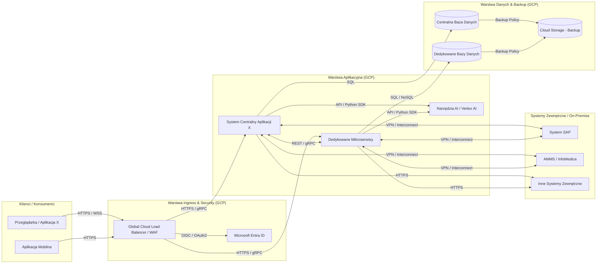
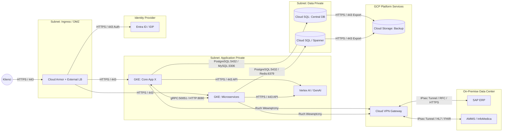

HLD i LLD Aplikacji X - przykład z perspektywy infrastruktury

# Diagram HLD

# Diagram LLD

# Macierz komunikacji

| Źródło (Source) | Cel (Destination) | Protokół | Port | Opis / Przeznaczenie |
| :--- | :--- | :--- | :--- | :--- |
| **Internet (User)** | Cloud Load Balancer (External) | HTTPS | `443` | Szyfrowany ruch kliencki (Web/Mobile) |
| **Cloud Load Balancer (External)** | Entra ID | HTTPS | `443` | Autentykacja użytkowników (OIDC/OAuth2 redirects) |
| **Cloud Load Balancer (External)** | GKE Ingress (App X / Mikroserwisy) | HTTPS / HTTP2 | `443` | Przekazywanie ruchu z LB do usług w klastrze |
| **Pod: App X (GKE Core)** | Pod: Mikroserwisy (GKE) | HTTP / gRPC | `8080`, `50051` | Komunikacja wewnętrzna między usługami |
| **GKE Pods (App X / Mikroserwisy)** | Vertex AI | HTTPS | `443` | Wywołania modeli AI/LLM (Private Google Access) |
| **GKE Pods (App X / Mikroserwisy)** | Cloud SQL (Central DB) | TCP | `5432` / `3306` | Dostęp do centralnej bazy danych (PostgreSQL / MySQL) |
| **GKE Pods (Mikroserwisy)** | Cloud SQL / Spanner (DB dedykowane) | TCP | `5432` | Dostęp do dedykowanych baz danych |
| **GKE Pods (Mikroserwisy)** | Redis (Cache) | TCP | `6379` | Dostęp do warstwy cache |
| **Cloud SQL / Spanner** | Cloud Storage (Backup) | HTTPS | `443` | Eksport danych i zrzuty backupowe |
| **GKE Pods (App X / Mikroserwisy)** | Cloud VPN Gateway | IPsec | `500`, `4500` | Tunelowanie ruchu do środowisk on-premise |
| **Cloud VPN Gateway** | SAP (On-Premise) | TCP / HTTPS | `443`, `33xx` | Integracja z SAP przez tunel VPN |
| **Cloud VPN Gateway** | AMMS / InfoMedica (On-Premise) | HTTPS (FHIR), TCP (HL7/MLLP) | `443`, `2575` | Wymiana danych medycznych przez Cloud VPN |

